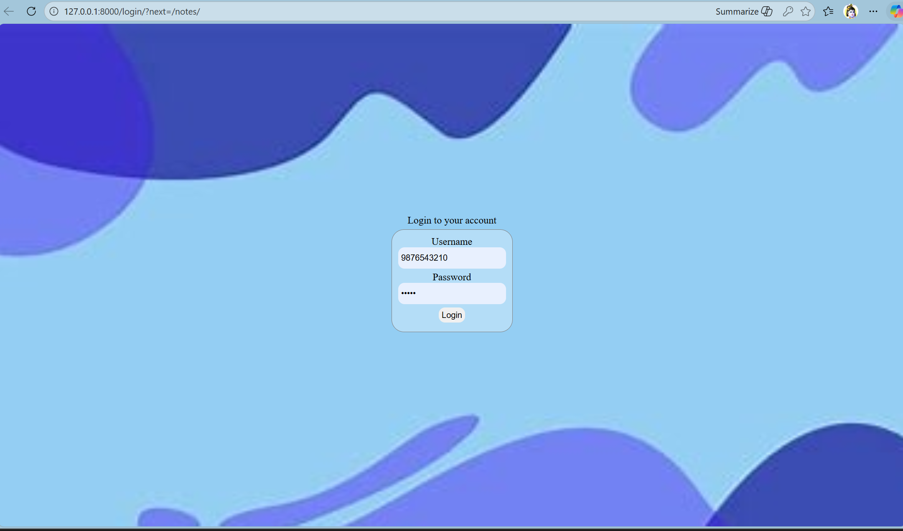

### NAME: AMAY JHA

### Roll no: 080BCT004

### Group: A

### Submitted to: Department of Electronics and Computer Engineering

### Lab: CRUD App using Django

Theory:

### Django

Django is a high-level Python web framework that encourages rapid development and clean, pragmatic design. Built by experienced developers, it takes care of much of the hassle of web development, so you can focus on writing your app without needing to reinvent the wheel. It’s free and open source.

Ridiculously fast.
Django was designed to help developers take applications from concept to completion as quickly as possible.

Reassuringly secure.
Django takes security seriously and helps developers avoid many common security mistakes.

Exceedingly scalable.
Some of the busiest sites on the web leverage Django’s ability to quickly and flexibly scale.

### NoteApp

This is a noteapp built on django with templates.
Features:

1. Register, login and logout system
2. Login session is saved using sessionId
3. User can add their notes
4. User can view all of their notes after login

## Output

